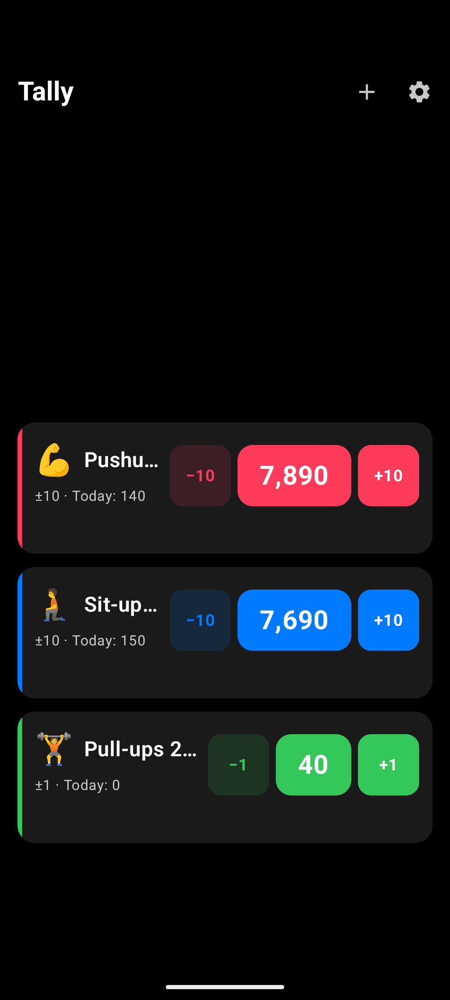
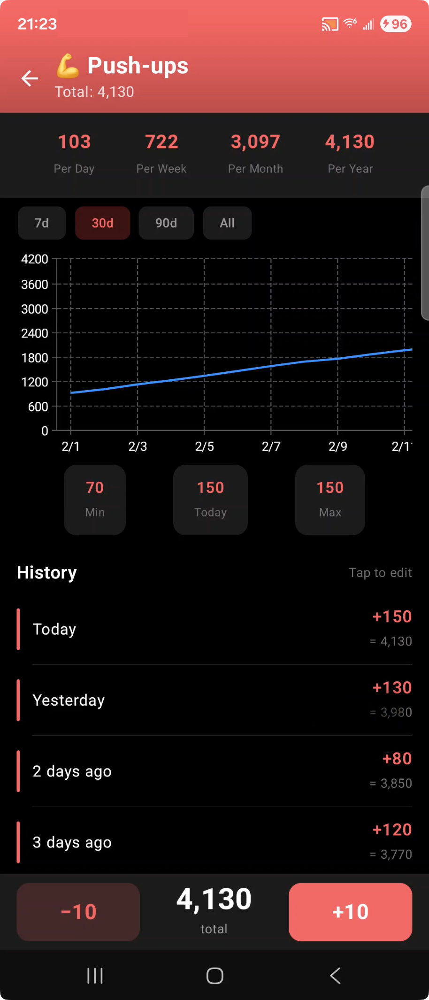

<p align="center">
  
</p>

<h1 align="center">Tally</h1>

<p align="center">
  A fast, beautiful tally counter for Android.<br/>
  Track anything. Count everything.
</p>

<p align="center">
  
  
  
</p>

---

## ✨ Features

- **Multiple counters** — track push-ups, water intake, inventory, anything
- **One-tap counting** — large, thumb-friendly +/- buttons with satisfying haptics and sound
- **Particle burst animations** — visual fireworks on every tap
- **Per-counter colors** — each counter gets its own accent from a curated palette
- **OLED dark theme** — pure black background, easy on eyes and battery
- **History & charts** — daily stats, trends over time (7d/30d/90d/all), min/max tracking
- **Smart averages** — set a start date for accurate per-day/week/month/year rates
- **Data you own** — local-only storage, CSV export, JSON backup/restore, auto-backup to Downloads
- **Migration-friendly** — starting count + start date for switching from other apps

## 📥 Download

Get the latest APK from [**Releases**](https://github.com/ehcheng/tally-counter-android/releases).

### How to install
1. Download the `.apk` file from the latest release
2. Open it on your Android device (transfer via USB, email, or direct download)
3. If prompted, tap **Settings** and enable **Install from unknown sources** for your browser/file manager
4. Tap **Install**
5. Requires Android 8.0 (Oreo) or newer

## 📱 Screenshots

<p align="center">
  
  &nbsp;&nbsp;&nbsp;
  
</p>

<p align="center">
  <a href="https://youtube.com/shorts/LqvIMn9NhiQ">▶️ Watch demo video</a>
</p>

## 🏗️ Build

**Requirements:**
- JDK 17
- Android SDK (Platform 35, Build Tools 35.0.0)
- Gradle 8.11.1 (wrapper included)

```bash
# Clone
git clone https://github.com/ehcheng/tally-counter-android.git
cd tally-counter-android

# Build
./gradlew assembleDebug

# APK at: app/build/outputs/apk/debug/app-debug.apk
```

## 🧱 Tech Stack

| | |
|---|---|
| **Language** | Kotlin 2.1 |
| **UI** | Jetpack Compose + Material 3 |
| **Database** | Room (SQLite) |
| **Charts** | Vico |
| **Architecture** | MVVM (ViewModel + StateFlow + Repository) |
| **Min SDK** | 26 (Android 8.0) |

## 📐 Design

- **OLED-first**: Pure black (`#000`) background, charcoal cards (`#1A1A1A`)
- **Bottom-anchored layout**: Cards sit in the lower third of the screen for easy thumb reach
- **56dp tap targets**: Well above the 44dp minimum for comfortable one-handed use
- **Choreographer-driven particles**: Hardware-synced animations that work on all devices (including Samsung)
- **18ms percussive tick**: Layered multi-frequency sound designed to feel mechanical and satisfying

## 📊 Stats

The detail screen shows rate-based statistics:

- **Per Day/Week/Month/Year** = total count ÷ days since start, projected out (capped at total)
- **Min / Today / Max** = based on daily entry values (excludes starting count)
- **Total** = starting count + all recorded entries

Set a **start date** when migrating from another app so your averages stay accurate.

## 💾 Data & Backup

All data stays on your device. No accounts, no cloud, no tracking.

- **Auto-backup**: Saves daily to `Downloads/tally-auto-backups/` (survives uninstall)
- **Manual backup**: Export full state as JSON, restore anytime
- **CSV export**: Share your data however you want
- **Google backup**: `allowBackup` enabled for Android's built-in backup

## 🪪 License

MIT

## 🙏 Credits

Inspired by [Taptic: Tally Counter](https://apps.apple.com/us/app/taptic-tally-counter/id1543467427) by Sergei Ivanov. iPhone users, please download his app if you need a great counter!

App icon: Tally the Turtle 🐢
